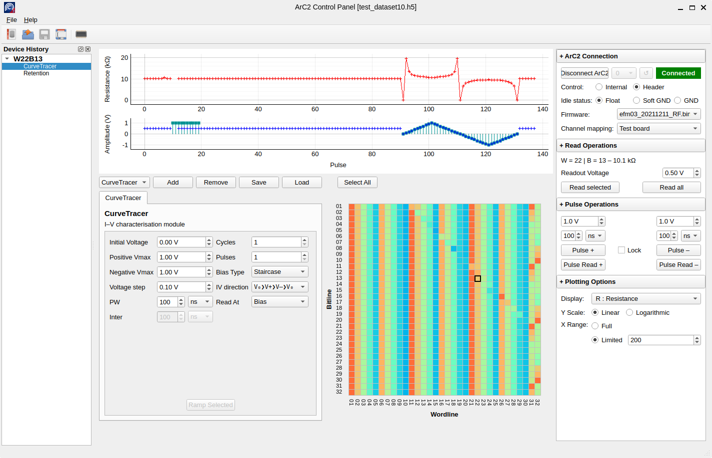

# ArC TWO™ Control Panel

This is the frontend application for ArC TWO. It exposes functionality mostly
related to crossbar configurations and provides a set of predefined
experiments suitable for general and (P/R/FE)RAM devices characterisation.



## Instructions

### Installation

If you have a recent Python installer, stable ArC2Control versions are
available from PyPI:

```
pip install arc2control
```

You can then run ArC2Control with:

```
python -m arc2control
```

Additionally, installers for Windows and AppImages for Linux are
made periodically available from our [releases
page](https://github.com/arc-instruments/arc2control/releases).

If you have git installed, you can also try out the latest development
snapshot:

```
pip install git+https://github.com/arc-instruments/arc2control
```

### Development

To develop on ArC2Control itself the recommended way to get started is by using
a virtual environment. ArC2Control uses [poetry](https://python-poetry.org) to
manage virtual environments. You might want to use a development version of
[pyarc2](https://github.com/arc-instruments/pyarc2) as well although that's
optional. We try to depend only on stable pre-built versions of `pyarc2` but
that's not guaranteed.

* [Optional] You will need a functional [Rust toolchain](https://rustup.rs).
* You will need a relatively new Python (≥ 3.8) and also have poetry
  installed (`python -m pip install poetry`). Pip must also be updated to at
  least version 20.x.
* Clone this repository and descend into it.
* Initialise the virtual environment: `python -m poetry install`. This only needs
  to be done once.
* [Optional] Update `pyarc2` to the latest development snapshot which can
  easily be done with the included script `poetry run python venv-pyarc2-update.py
  git+https://github.com/arc-instruments/pyarc2`.  This will download `pyarc2` via git,
  build it and install it into the virtualenv.
* Run the setup script `poetry run python setup.py build`.
* Run ArC2Control `poetry run python -m arc2control`.

## Custom modules

ArC2Control can be extended with custom experiment panels. An ArC2Control experiment
module is a standalone Python module that includes the following in its `__init__.py`.

```python
MOD_NAME = 'ModuleName'
MOD_DESCRIPTION = 'Description of said module'
MOD_TAG = 'MN' # a shorthand tag for the module
BUILT_IN = False

from .module import MainModule
# MainModule must derive from arc2control.modules.base.BaseModule`
ENTRY_POINT = MainModule
```

The built-in experiment modules are also built with the same infrastructure so
they can be used as a scaffold to build your own.

## I have a question

Feel free to make a new topic under
[Discussions](https://github.com/arc-instruments/arc2control/discussions). This
should be your first stop for support unless you are somewhat certain you run
into a bug (which is very possible at this stage). In that case…

## I found a bug!

If ArC2Control does not behave as you would expect please [open an
issue](https://github.com/arc-instruments/arc2control/issues/new) describing the
problem and how to reproduce it. Don't forget to mention the operating system
you are running on!
