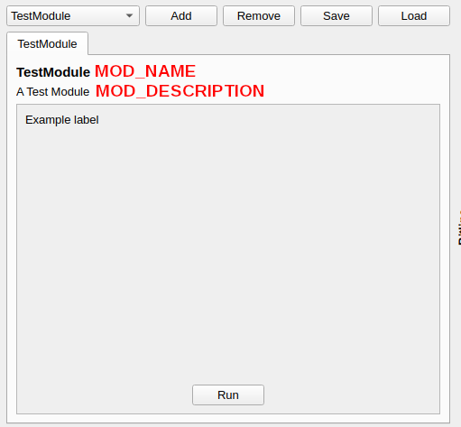
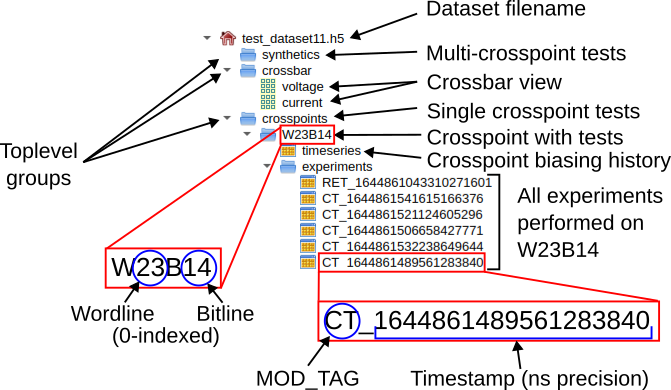
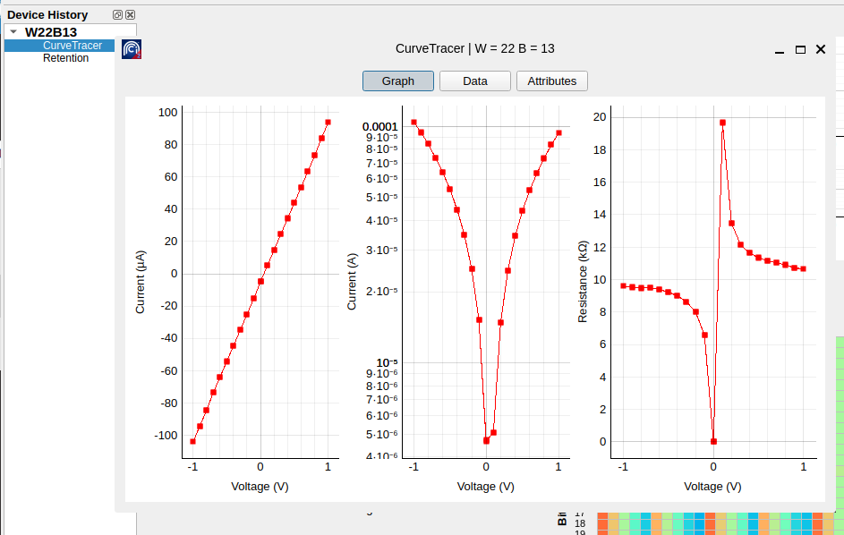

ArC2Control emodules
====================

Introduction
------------

ArC TWO Control Panel provides a mechanism for users to create their own
experiments using ArC TWO. These are typically specialised control panels
that are registered during program startup and are available from the
main ArC TWO Control Panel Experiment dropdown menu. We call the control
panels *external modules* or *emodules*. This document serves as a tutorial
to help you develop your own modules.

An emodule is essentially a standalone Python project that exposes a few
interfaces that are compatible with the ArC TWO Control Panel. ArC2Control
emodules should be placed at the corresponding data directory for your
operating system. On Windows these directories are (higher to lower priority)

* ``%APPDATA%\arc2control\arc2emodules``
* ``C:\ProgramData\arc2control\arc2emodules``
* ``PYTHONDIR\arc2control``
* ``PYTHONDIR\data\arc2control``

and on Linux these are (higher to lower priority)

* ``~/.local/share/arc2control/arc2emodules``
* ``/usr/local/share/arc2control/arc2emodules``
* ``/usr/share/arc2control/arc2emodules``

Regardless of the path you choose an empty ``__init__.py`` file must be
created under ``arc2emodules`` to allow custom modules to be loaded from
there.

A typical tree structure for an emodule called ``testmodule`` located
in ``%APPDATA%\arc2control`` would look like this

.. code-block::
   :caption: ArC2Control emodule directory structure including one emodule
             named ``testmodule``

   arc2emodules
   ├── __init__.py  ← this must exist for any emodule to be loaded
   └── testmodule   ← toplevel directory of our emodule
       ├── __init__.py   ← module metadata and identifiers
       ├── testmodule.py ← module code with entry-point
       └── another.py    ← additional python source used by this module

Of course modules can span multiple files, can have compilation steps and
anything else that might be required for your use case.

Anatomy of an emodule
---------------------

.. note::
   The module system for ArC TWO Control Panel heavily depends on the Qt
   framework and its Python bindings. Although an attempt has been made to make
   this guide as agnostic as possible a degree of familiarity with the Qt
   framework (in any language) would go a long way.

For an emodule to be loaded into ArC2Control two things must be true: (a) Its
``__init__.py`` must specify the *entry point* of the module and (b) the entry
point *must* derive from :class:`~arc2control.modules.base.BaseModule` which
essentially is a custom Qt6 QWidget with some extra quality of life improvements
bolted in.

Going back to our example ``testmodule`` emodule this is how a correct
``__init__.py`` would look like

.. code-block:: python
   :caption: An example __init__.py file for an emodule

   # Human readable name for the module - No whitespace
   MOD_NAME = 'TestModule'
   # A unique identifier
   MOD_TAG = 'TSM00'
   # A descriptive line of text
   MOD_DESCRIPTION = 'Demonstrate the emodule functionality'
   # Always False for modules residing outside the arc2control repository
   BUILT_IN = False

   # define the main class for this emodule; the entry point
   from .testmodule import TestModule
   ENTRY_POINT = TestModule

It should be mentioned that the ``MOD_TAG`` field must be a unique identifier
for your module. There are no checks for identifier clash allowing you to
possibly override built-in modules by reimplementing them as emodules to add
or alter functionality. It is recommended that you avoid overriding internal
tags unless you really know what you are doing. Things might fail spectacularly
otherwise.

Once ``__init__.py`` is filled in you can proceed into developing the logic of
your emodule. In this example the logic is implemented in
``testmodule/testmodule.py``.

.. code-block:: python
   :caption: Anatomy of the main emodule file ``testmodule/testmodule.py``

   from PyQt6 import QtWidgets
   from arc2control.modules.base import BaseModule
   from . import MOD_NAME, MOD_TAG, MOD_DESCRIPTION

   class TestModule(BaseModule):

       def __init__(self, arc, arcconf, vread, store, cells, mapper, parent=None):
           # calling superclass constructor with all the arguments
           BaseModule.__init__(self, arc, arcconf, vread, store, MOD_NAME, \
               MOD_TAG, cells, mapper, parent=parent)

           # build the UI
           self.setupUi()

           # make the button do something
           self.runButton.clicked.connect(self.onRunClicked)

       def setupUi(self):
           self.setObjectName('TestModuleWidget')
           self.gridLayout = QtWidgets.QGridLayout(self)
           self.gridLayout.setContentsMargins(0, 0, 0, 0)
           spacer00 = QtWidgets.QSpacerItem(0, 20, \
                QtWidgets.QSizePolicy.Policy.Expanding, \
                QtWidgets.QSizePolicy.Policy.Minimum)
           self.gridLayout.addItem(spacer00, 2, 1, 1, 1)
           spacer01 = QtWidgets.QSpacerItem(20, 0, \
                QtWidgets.QSizePolicy.Policy.Minimum, \
                QtWidgets.QSizePolicy.Policy.Expanding)
           self.gridLayout.addItem(spacer01, 7, 0, 1, 1)

           self.horizontalLayout = QtWidgets.QHBoxLayout()
           spacer02 = QtWidgets.QSpacerItem(40, 20, \
                QtWidgets.QSizePolicy.Policy.Expanding, \
                QtWidgets.QSizePolicy.Policy.Minimum)
           self.horizontalLayout.addItem(spacer02)

           self.runButton = QtWidgets.QPushButton(self)
           self.runButton.setObjectName("runButton")
           self.horizontalLayout.addWidget(self.runButton)

           spacer03 = QtWidgets.QSpacerItem(40, 20, \
                QtWidgets.QSizePolicy.Policy.Expanding, \
                QtWidgets.QSizePolicy.Policy.Minimum)
           self.horizontalLayout.addItem(spacer03)

           self.gridLayout.addLayout(self.horizontalLayout, 8, 0, 1, 2)
           self.label = QtWidgets.QLabel(self)
           self.label.setText("Example label")
           self.gridLayout.addWidget(self.label, 0, 0, 1, 1)

       def onRunClicked(self):
           print('Clicked!')

Most of the code above deals with setting up the UI, it is fairly standard Qt
code. The most important part is probably the constructor of the class which
takes a bunch of arguments. These are populated by ArC2Control when you
activate the new panel on the main GUI so you should not need to deal with them
directly. They will be connected to properties by the superclass,
:class:`~arc2control.modules.base.BaseModule` and will be available to use from
within your new emodule.

Starting ArC2Control again a new entry, *TestModule*, should be
available from the experiment dropdown menu. Clicking add will activate the
following panel and clicking *Run* will print "Clicked!" on your terminal.

   A basic emodule panel

As it is now the *Run* button does not do anything useful. We will modify it to
perform a current read on the specified crosspoint if an ArC TWO is available.

.. code-block:: python
   :caption: Modified ``onRunClicked``

   def onRunClicked(self):
       # self.cells is a set containing the current selection, we will only
       # one if available

       try:
           cell = list(self.cells)[0]
       except IndexError:
           # nothing selected; break
           return

       # get wordline and bitline from the cell
       (w, b) = (cell.w, cell.b)
       # convert it into an ArC TWO channel using the self.mapper.wb2ch
       # wb2ch is a dict property populated automatically by ``BaseModule``
       # and points to the current channel mapper.
       (high, low) = self.mapper.wb2ch[w][b]

       # the current global read-out voltage; populated automatically by
       # ``BaseModule``.
       vread = self.readoutVoltage

       # self.arc is populated by ``BaseModule`` and will return ``None`` if
       # no ArC TWO is currently connected.
       if self.arc is not None:
           # do a current measurement
           current = self.arc.read_one(low, high, vread)
           # set channels back to the currently configured idle mode
           # (again populated automatically by ``BaseModule``)
           self.arc.finalise_operation(self.arc2Config.idleMode)

           print('I = %g A' % current)

The above example performs a current read on the first selected device and
prints the result in the terminal. The ArC TWO related functionality is
exposed by pyarc2_ so consult its documentation for specific information.

Please note that ArC TWO doesn't have any concept of crosspoints. It will do
operations on any of the 64 channels which can be interconnected arbitrarily.
In order to convert between abstract channels and something more meaningful
like word- and bitlines a *mapping* mechanism is provided. Depending on your
applications and active daughterboard different mappings might be relevant. On
the code above the active cell coordinates are converted to the underlying
channel numbers via the ``mapper`` property available on all subclass of
``BaseModule``. The superclass code takes care of any changes in the mapper
introduced by the user automatically so that ``self.mapper`` will always point
to the currently active mapping scheme. You can read more about the mapper API
or how to crate new mappings on a :doc:`subsequent section </api_mapper>`.

Backgrounding operations
------------------------

.. warning::
   You should only run *only one* background operation at a time. Although
   ArC TWO provides locking semantics there is no fencing mechanism for
   synchronisation and running two command queues at the same time will lead
   to resulting data being received out of order.

The above example presents a relatively simplistic way of interacting with ArC
TWO. However for more complex operations such as a voltage ramp, for example,
implementing the logic of the operation in the callback will result into the
main GUI blocking and becoming unresponsive (this is a common issue with UI
toolkits in general). In order to avoid that and have some degree of
interactivity we should introduce *background operations*.  These essentially
are background threads that are I/O bound (ie. slow but not very
computationally expensive). Qt provides quite a sophisticated threading library
and you can in fact start implementing operations right away with QThreads,
however you still need to monitor ArC2Control for changes in read-out voltage,
selections, etc.  In order to avoid repetition a simple
:class:`~arc2control.modules.base.BaseOperation` class is provided. Similar to
:class:`~arc2control.modules.base.BaseModule` it will abstract away some
boilerplate code and will expose several primitives as properties. You only
need to implement its :meth:`~arc2control.modules.base.BaseOperation.run`
method and start the operation as any other QThread. Let's add such a class to
``testmodule/testmodule.py``.

.. code-block:: python
   :caption: Class ``TestModuleOperation`` added to ``testmodule/testmodule.py``

   import time
   from arc2control.modules.base import BaseOperation
   from PyQt6.QtCore import pyqtSignal

   # signal emitted when a new value is received
   newValue = pyqtSignal(float)
   # signal emitted when the process has been completed
   finished = pyqtSignal()

   class TestModuleOperation(BaseOperation):

       def __init__(self, parent):
           super().__init__(parent=parent)

       def run(self):

           # pickup the first selected cell
           try:
               cell = list(self.cells)[0]
               vread = self.readoutVoltage()
               (high, low) = self.mapper.wb2ch[cell.w][cell.b]
           except IndexError:
               # or exit if nothing is selected
               self.finished.emit()
               return

           for _ in range(10):
               # do a current measurement
               current = self.arc.read_one(low, high, vread)
               # communicate the new value to the UI
               self.newValue.emit(current)
               self.arc.finalise_operation(self.arc2Config.idleMode)
               # artificial wait time
               time.sleep(1)

           self.finished.emit()

There are two particular points of note on the example above. First, the ``run``
function which implements the logic of the long running operation. This essentially
does 10 subsequent readings on the first selected device with an 1 sec delay between
them. Second it's the introduction of custom signals as class attributes. Signals are
used to communicate the status of the background operation to the main UI. This is
similar to built-in signals such as ``clicked``, ``triggered``, etc. that are exposed
by regular UI components but they carry custom values instead. In order to pick up
a new value from the background thread one needs to connect the signal to a python
function. Let's update our ``onRunClicked`` function of ``TestModule`` to launch a
measurement thread.

.. code-block:: python
   :caption: Modified ``onRunClicked`` to launch and monitor a thread

   def onRunClicked(self):

       # callback called whenever a new value is produced
       def onNewValue(value):
           print('I = %g A' % value)

       # callback called when the thread exits
       def onFinished():
           self.operation.wait()
           self.operation = None

       try:
           if self.operation is not None:
               # an operation is currently running; abort
               return
       except AttributeError:
           self.operation = None

       self.operation = TestModuleOperation()
       self.operation.newValue.connect(onNewValue)
       self.operation.finished.connect(onFinished)
       self.operation.start()

The code above will launch ``TestModuleOperation`` in background. For
illustration purposes we connect the two signals emitted to two nested
functions, although these can be any type of function reference. It is
important to note that we should make sure that we should only launch *one*
operation at a time to avoid concurrent access to ArC TWO. In order to do that
we start the operation only when ``self.operation`` is not defined at all or
it's ``None``. Every time a new value is produced by the thread the
``onNewValue`` function is called which subsequently prints the value on the
terminal. When the thread is finished the ``onFinished`` function is called.
This will first wait for the thread to actually terminate (ie. the ``run``
function of the thread to return) and when that's done the reference to
the operation is set to ``None`` and the thread is finally dropped. A new
operation can now be launched if required.

Storing data
------------

.. note::
   You can read about the storage system in detail  on a :doc:`follow-up
   section </api_storage>`. Familiarity with HDF5 format or the h5py_ module
   will also be helpful.

In all of the examples above we just print the data to the terminal, we do not
actually store any data. ArC2Control uses an HDF5-based file format to store
all data produced by modules, either buit-in or external. Every emodule has
access to the currently enabled dataset via the ``datastore`` property. As
with other properties these are updated automatically whenever a change has
occurred on the main GUI.

Data is stored on disk on a single HDF5 file with an hierarchical format.
The data file contains all biasing history for every device as well as the
latest current and voltage values of the full crossbar. Apart from that
the datastore supports two types of experiment: (a) crosspoint-bound
experiments that are specific to a single crosspoint and (b) synthetic
experiments that span multiple crosspoints. Scenario (a) would probably be
the most common if you only do individual device characterisation.

   Structure of the HDF5 data file used by ArC2Control

The data file is organised as shown in the figure above. The toplevel groups as
well as the ``voltage`` and ``current`` crossbar view are always created
automatically when a new dataset is created. Generally you should not need to
create HDF5 groups, or even datasets, manually as calling
:meth:`~arc2control.h5utils.H5DataStore.make_wb_table` or
:meth:`~arc2control.h5utils.H5DataStore.make_synthetic_table` will create the
necessary groups and tables automatically. Of course, if you know what you are
doing, the actual `h5py.Dataset`_ is available through the
:meth:`~arc2control.h5utils.H5DataStore.dataset` method. Knowing these let's
modify ``TestModuleOperation`` to save the data to the datastore at the end
of the operation.

.. code-block:: python
   :caption: Updated ``TestModuleOperation`` to save data at the end of the
             process.

   import time
   import numpy as np
   from arc2control.modules.base import BaseOperation
   from PyQt6.QtCore import pyqtSignal
   from . import MOD_TAG

   # signal emitted when a new value is received
   newValue = pyqtSignal(float)
   # signal emitted when the process has been completed
   finished = pyqtSignal()

   # this a numpy dtype to store data
   _DTYPE = [('current', '<f4')]

   class TestModuleOperation(BaseOperation):

       def __init__(self, parent):
           super().__init__(parent=parent)

       def run(self):

           # pickup the first selected cell
           try:
               cell = list(self.cells)[0]
               vread = self.readoutVoltage()
               (high, low) = self.mapper.wb2ch[cell.w][cell.b]
           except IndexError:
               # or exit if nothing is selected
               self.finished.emit()
               return

           data = np.empty(shape=(10, ), dtype=_DTYPE)

           for idx in range(10):
               # do a current measurement
               current = self.arc.read_one(low, high, vread)
               data[idx] = current
               # communicate the new value to the UI
               self.newValue.emit(current)
               self.arc.finalise_operation(self.arc2Config.idleMode)
               # artificial wait time
               time.sleep(1)

           self.storeData(cell.w, cell.b, data)
           self.finished.emit()

       def storeData(self, word, bit, data):
           store = self.datastore

           # make a new table to store the data
           dset = store.make_wb_table(word, bit, MOD_TAG, \
               data.shape, _DTYPE)
           # allocate values column-wise; in this case one column
           for field in _DTYPE:
               dset[:, field] = data[field]

The code above should be relatively straightforward: we create a numpy array to
store the readings and at the end of the process we commit it to the dataset by
column-wise assignment. It's probably important to mention that HDF5 datasets
are strongly typed and in ``h5py`` this is done via `numpy dtypes`_ for `numpy
structured arrays`_. It is convenient, in this case, to allocate an array to
store the data and then broadcast it over the dataset. Of course, that's only
one way to store data; you could, for instance, allocate a dataset at the start
of the process and save the data line-by-line which would work equally well.
The datasets require an identifier, and although you could probably use
anything, it is recommended that you use the ``MOD_TAG`` defined when
initialising the emodule.

Communicating changes to the ArC2Control UI
-------------------------------------------

So far we've seen how to apply an operation on a selected crosspoint and store
the resulting data in the datastore. What you may have noticed, however, the
main UI (essentially the graph panel) does not get updated with the latest
data. This happens because the main UI does not have any insight into the inner
workings of each module. In order to communicate changes to the UI and also
update the global history of a device a module would need to *emit some
signals* that will be picked up by the UI and update the interface. Similar to
the custom signals, ``finished`` and ``newValue``, that we defined in our
``TestModuleOperation`` the main ArC2Control UI also defines some signals that
are globally available to modules. :doc:`The full list </api_signals>` of the
signals defined from ArC2Control is available although for emodule development
the most useful ones are (i) :meth:`~arc2control.signals.valueUpdate` to update
the current voltage and current status of a crosspoint with a single value;
(ii) :meth:`~arc2control.signals.valueBulkUpdate` that does the same using
numpy arrays for multiple data updates and (iii)
:meth:`arc2control.signals.dataDisplayUpdate` to request a refresh of the
plotting panels on the main UI. Let's update our ``run`` function to update
the crosspoint status on every loop and request a data display refresh at
the end.

.. code-block:: python
   :caption: Updated ``TestModuleOperation`` to communicate data changes
             to the main ArC2Control GUI.

   import time
   import numpy as np
   from arc2control.modules.base import BaseOperation
   from arc2control.signals import valueUpdate, dataDisplayUpdate
   from arc2control.h5utils import OpType
   from PyQt6.QtCore import pyqtSignal
   from . import MOD_TAG

   # signal emitted when a new value is received
   newValue = pyqtSignal(float)
   # signal emitted when the process has been completed
   finished = pyqtSignal()

   # this a numpy dtype to store data
   _DTYPE = [('current', '<f4')]

   class TestModuleOperation(BaseOperation):

       def __init__(self, parent):
           super().__init__(parent=parent)

       def run(self):

           # pickup the first selected cell
           try:
               cell = list(self.cells)[0]
               vread = self.readoutVoltage()
               (high, low) = self.mapper.wb2ch[cell.w][cell.b]
           except IndexError:
               # or exit if nothing is selected
               self.finished.emit()
               return

           data = np.empty(shape=(10, ), dtype=_DTYPE)

           for idx in range(10):
               # do a current measurement
               current = self.arc.read_one(low, high, vread)
               data[idx] = current
               # communicate the new value to the UI
               self.newValue.emit(current)
               self.arc.finalise_operation(self.arc2Config.idleMode)

               # and update the crosspoint status; we've put 0.0
               # as a pulse width since this is a Read operation
               # that's also the reason why ``vpulse`` and ``vread``
               # are identical
               valueUpdate.emit(cell.w, cell.b, current, vread, 0.0,
                   vread, OpType.READ)

               # artificial wait time
               time.sleep(1)

           # finally request a display refresh for our crosspoint
           dataDisplayUpdate.emit(cell.w, cell.b)

           self.storeData(cell.w, cell.b, data)
           self.finished.emit()

       def storeData(self, word, bit, data):
           store = self.datastore

           # make a new table to store the data
           dset = store.make_wb_table(word, bit, MOD_TAG, \
               data.shape, _DTYPE)
           # allocate values column-wise; in this case one column
           for field in _DTYPE:
               dset[:, field] = data[field]

In the updated example the :meth:`~arc2control.signals.valueUpdate` is emitted
every time a reading is done. Our module has relatively slow repetition so
updating values at every step is acceptable. However if you are pulling large
amounts of data quickly from ArC TWO then it would probably make better sense
to buffer the data and use :meth:`~arc2control.signals.valueBulkUpdate` on
specific intervals instead. Finally, after the loop has finished,
:meth:`arc2control.signals.dataDisplayUpdate` is called to force refresh of the
main UI graphing panel. You can do data display updates faster or slower depending
on the amount and rate of data you are reading from ArC TWO. You should always
keep in mind that very frequent UI updates will result in your main UI thread
consuming too much CPU time so you should throttle the data display refreshes at
a reasonable level. A few displays per second is probably fine, but many thousands
will lead to massive slowdowns on the main UI thread.

Displaying data
---------------

One additional facility provided by ArC2Control emodules is the capability to
display custom display and analysis widgets tied to a specific module. In the
example below double-clicking on the *CurveTracer* entry in the device history
tree will bring up a representation of the data for this specific experiment.

   Double clicking a module name on the device history tree will bring up a
   suitable data display widget

Data display widgets can be any type of widget that derives from ``QWidget``.
That means you can have full featured visualisation and analysis tools for your
custom experiments. This facility is typically provided by the *static method*
``display`` provided by the main panel of the module, in this case our
``TestModule``. The method *must* return anything that subclasses ``QWidget``.
or just a ``QWidget``. In this exampe we will add a ``display`` method that
plots our readings.

.. code-block:: python
   :caption: Added ``display`` function to ``TestModule`` to plot acquired
             data.

   from PyQt6 import QtWidgets
   from arc2control.modules.base import BaseModule
   from . import MOD_NAME, MOD_TAG, MOD_DESCRIPTION
   import pyqtgraph as pg

   class TestModule(BaseModule):

       # rest of the implementation omitted for brevity

       @staticmethod
       def display(dataset):
           current = dataset['current']
           wdg = QtWidgets.QWidget()
           layout = QtWidgets.QVBoxLayout()
           gv = pg.GraphicsLayoutWidget()
           plot = gv.addPlot()
           plot.getAxis('left').setLabel('Current', units='A')
           plot.getAxis('bottom').setLabel('Reading #')
           plot.showGrid(x=True, y=True)

           plot.plot(range(0, current.shape[0]), current, pen='r')
           layout.addWidget(gv)
           wdg.setLayout(layout)

           return wdg

The only argument to the ``display`` method is the dataset associated with
entry the user selected on the main GUI which is exactly the same dataset we
created with the associated functions before. In this specific example above we
construct a ``QWidget``, add a layout and a graphing widget. We use pyqtgraph_
for plotting, which is the same library used by ArC2Control and it's always
available to the modules. Of course, depending on your requirements, you can
use matplotlib or any other visualisation package. When the user activates
the entry on the device history tree the widget returned by ``display`` will
be put on window and displayed to the user, pretty much identically to the
CurveTracer figure shown above.

Logging information
-------------------

Regardless of the complexity of your module you will eventually have to log
information. The humble ``print`` can get you quite far but you might need
something more structured. Both :class:`arc2control.modules.base.BaseModule`
and :class:`arc2control.modules.base.BaseOperation` expose the ``logger``
property that plugs into the main ArC2Control logging facility. You can then
log information to the console in varying degrees of severity. The verbosity of
the messages is controlled by an environment variable set before launching
ArC2Control: ``ARC2CTRL_LOGLEVEL`` which can be any of ``critical``, ``error``,
``warn``, ``info``, ``debug`` with increasing degree of verbosity and
decreasing severity. At any given logging level only message of equal or higher
severity will be displayed. The default logging level is ``warn``. With that in
mind you can log information at varying severity levels like this

.. code-block:: pycon

   >>> self.logger.error('An error message; this will typically halt the module')
   [ERROR] [TSM00] An error message; this will typically halt the module
   >>> self.logger.warn('Something went wrong; results may be unreliable')
   [WARNING] [TSM00] Something went wrong; results may be unreliable
   >>> self.logger.info('Useful information')
   [INFO] [TSM00] Useful information
   >>> self.logger.debug('Detailed info about the module runtime')
   [DEBUG] [TSM00] Detailed info about the module runtime

You can read more about Python's logging facilities in the `official
documentation <https://docs.python.org/3/library/logging.html>`_.

Final words
-----------

This concludes our tour of the module facility of ArC2Control. You can
use this tooling to create your own experiments, simple or complex,
to tailor the capabilities of ArC TWO to your own needs. You can find
more details on the data store, channel mapping and signal APIs in the
following sections.

API Reference
-------------

.. automodule:: arc2control.modules.base
    :members:

.. _pyarc2: https://github.com/arc-instruments/pyarc2
.. _h5py: https://docs.h5py.org/en/stable/
.. _`h5py.Dataset`: https://docs.h5py.org/en/stable/high/dataset.html
.. _`numpy dtypes`: https://numpy.org/doc/stable/reference/arrays.dtypes.html
.. _`numpy structured arrays`: https://numpy.org/doc/stable/user/basics.rec.html
.. _`pyqtgraph`: https://github.com/pyqtgraph/pyqtgraph
