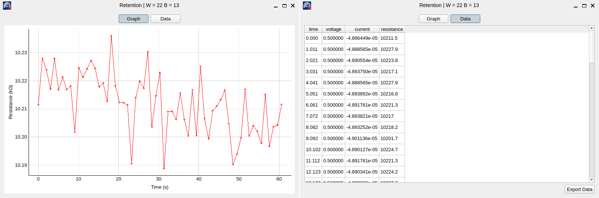
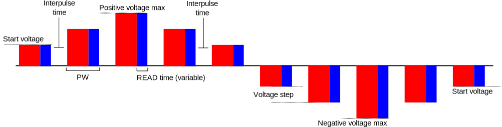
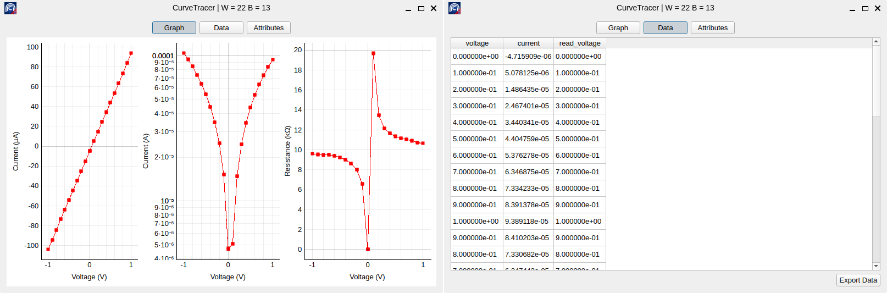

Built-in modules
================

ArC2Control comes with an ever expanding collection of experiment modules. They
are tailored with crosspoint operations in mind, although they should apply to
any kind of two-terminal DUT. More modules will be made available in
subsequent releases. All built-in modules typically feature a graph page and a
data page which allows you to export the data to an external file.

Retention
^^^^^^^^^

*Retention* is the archetypal "read over time" experiment. It will read one or
more crosspoints in fixed intervals at the specified read-out voltage.

.. list-table:: Experimental parameters for *Retention*
   :widths: 25 50 25
   :header-rows: 1
   :align: center

   * - Parameter
     - Description
     - Default value
   * - Read every
     - Interval between subsequent reads
     - 1 second
   * - Read for
     - Total retention duration
     - 1 minute
   * - Read at
     - Read-out voltage
     - Global read-out
   * - Use global read-out?
     - Whether global read-out should be used
     - Yes

   A typical result from a Retention experiment: graph (left) and
   raw data (right).

Curve Tracer
^^^^^^^^^^^^

*CurveTracer* is another typical experiment that applies a voltage ramp
and reads at a specified voltage. It is used to produce an I–V curve
of the DUT.

.. list-table:: Experimental parameters for *CurveTracer*
   :widths: 25 50 25
   :header-rows: 1
   :align: center

   * - Parameter
     - Description
     - Default value
   * - Initial voltage
     - Voltage starting point
     - 0.0 V
   * - Positive Vmax
     - The maximum positive polarity voltage
     - 1.0 V
   * - Negative Vmax
     - The maximum negative polarity voltage
     - (-)1.0 V
   * - Voltage step
     - Voltage increment per measurement
     - 0.1 V
   * - PW
     - Pulse width or step time
     - 100 ns
   * - Inter
     - Delay between pulses (pulsing mode only)
     - 100 ns
   * - Cycles
     - Repetition of each measurement loop
     - 1
   * - Pulses
     - Number of voltage pulses per step
     - 1
   * - Bias Type
     - Modality of pulsing (pulsed or staircase)
     - Staircase
   * - IV direction
     - Loop direction
     - V₀ → V+ → V– → V₀
   * - Read At
     - Read-out voltage (at bias or global read-out)
     - Bias

CurveTracer has two different modalities of operation, either *Staircase* or
*Pulsed*. In the first case bias is never removed from the DUT; it just
increases at each step the width of which is governed by the *PW* attribute.
The latter option will apply one or more PW-wide pulses per step followed by an
interval specified by the *Inter* attibute when the voltage is reverted to
0.0 V.

   Visualisation of the algorithm used by a pulsed CurveTracer test for 1
   cycle, 1 pulse per step, ReadAt bias voltage and loop direction order V₀ →
   V+ → V– → V₀.

   A typical result from a CurveTracer: graph (left) and raw data (right).
   Graph view shows linear and logarithmic current as well as resistance of the
   DUT.
