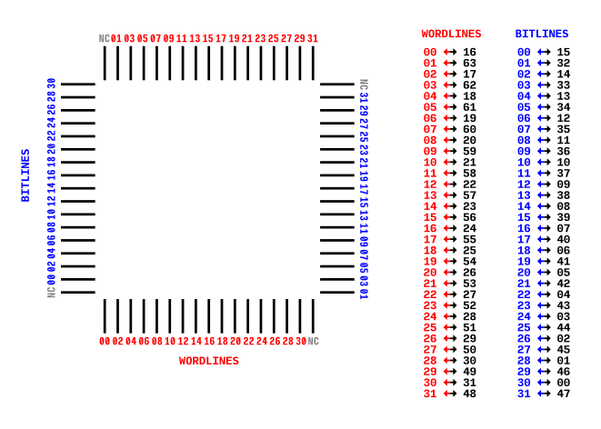
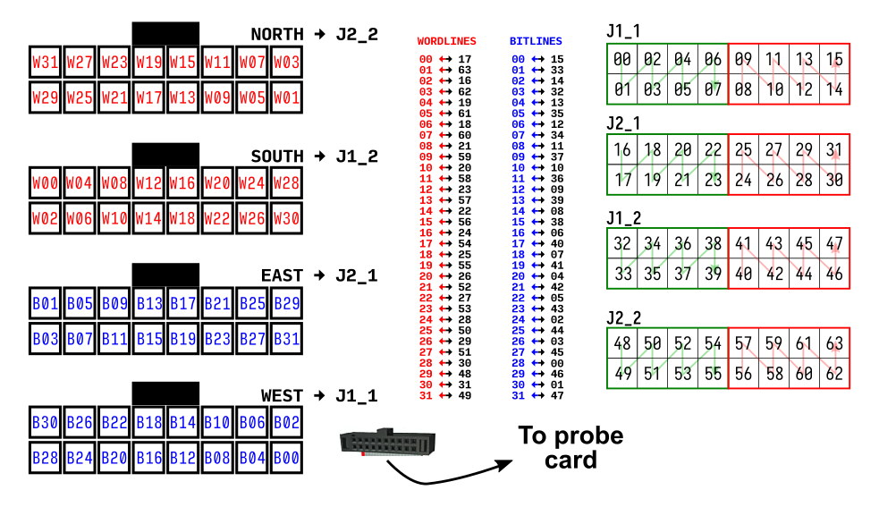

Daughterboard pinouts
=====================

The daughterboards that ship with ArC2 have their pins associated with a
specific channel. Below you can find the current revision of channel-pin
mappings for the standard daughterboards as well as the word- and bitline
associated in the ArC TWO Control UI. Please note that our standard
convention is that all channels are 0-indexed and all notches on ribbon
cables should be facing outside.

32NNA68
-------

         package of the 32NNA68 daughterboard

   Word-/Bitline and channel association for the CQFJ package of
   the 32NNA68 daughterboard

         headers of the 32NNA68 daughterboard

   Word-/Bitline and channel association for the onboard headers
   of the 32NNA68 daughterboard
