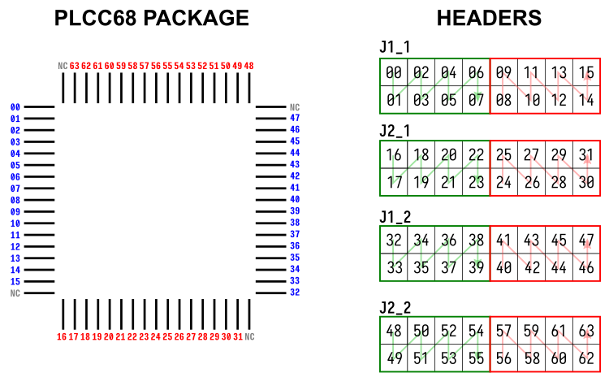

Daughterboard pinouts
=====================

The daughterboards that ship with ArC2 have their pins associated with a
specific channel. Below you can find the current revision of channel-pin
mappings for the standard daughterboards as well as the word- and bitline
associated in the ArC TWO Control UI. Please note that our standard
convention is that all channels are 0-indexed and all notches on ribbon
cables should be facing outside.

32NNA68
-------

The standard 32NNA68 daughterboard is an *active* daughterboard meaning
there is additional logic on-board to manage switching between the pins
and the socket. When IO0 is HIGH the ArC TWO is wired to the header banks,
when LOW to the PLCC68 socket.

         pins of the 32NNA68 daughterboard

   Associated channels for the PLCC68 package and the headers pins
   of the 32NNA68 daughterboard

