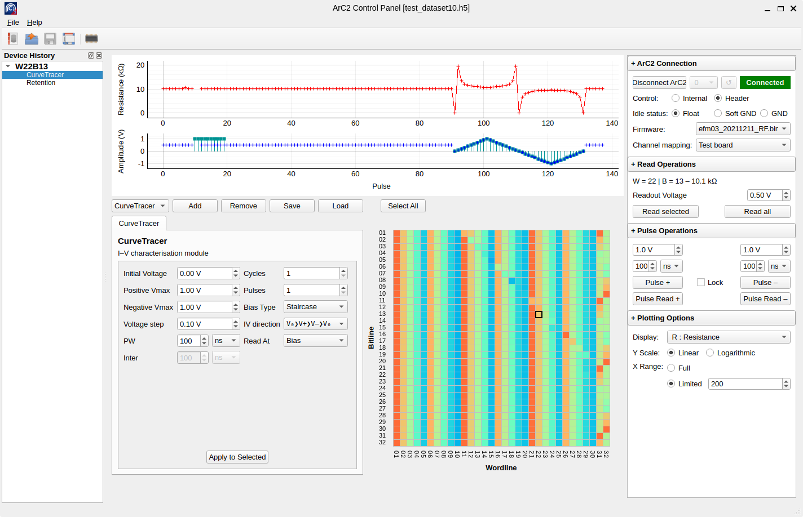

.. pyarc2 documentation master file, created by
   sphinx-quickstart on Thu Jun  9 20:51:30 2022.

ArC TWO Control Panel
=====================

This is the reference application to interact with your ArC TWO multi-channel
characterisation platform. It is based on the pyarc2_ library which exposes
a Python interface to all the underlying functionality of ArC TWO.

Installation
------------

ArC TWO Control Panel is currently available from git.

.. code-block:: console

   $ pip install git+https://github.com/arc-instruments/arc2control

You will additionally need the necessary libusb driver to
interact with ArC TWO. ``pyarc2`` wheels will typically include the library
that implements the FPGA API (see beastlink_) but the actual USB driver should
be installed separately for your operating system. This is typically included
with the CESYS distribution of beastlink. Check `CESYS download page`_ for more
details. For Windows run the installer provided by CESYS. For Linux scripts to
generate suitable packages for Archlinux, Debian-based and RedHat compatible
distributions are available from `our repository`_.

At this moment ArC TWO Control Panel is only available for Windows and glibc
Linux x86_64.  That's due to limitations of beastlink. Minimal functionality
for browsing and analysing results will be provided for macOS soon™.

Contents of this guide
======================

.. toctree::
   :maxdepth: 2
   :caption: User guide

   overview

.. toctree::
   :maxdepth: 2
   :caption: Developer's documentation

   api_modules
   api_storage
   api_mapper
   api_signals

.. _pyarc2: https://github.com/arc-instruments/pyarc2
.. _beastlink: https://www.cesys.com/en/our-products/software-ip/beastlink.html
.. _`CESYS download page`: https://www.cesys.com/en/service-support/download-center/fpga.html
.. _`our repository`: https://github.com/arc-instruments/beastlink-rs/tree/master/contrib
