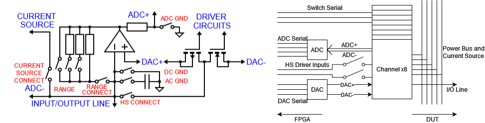
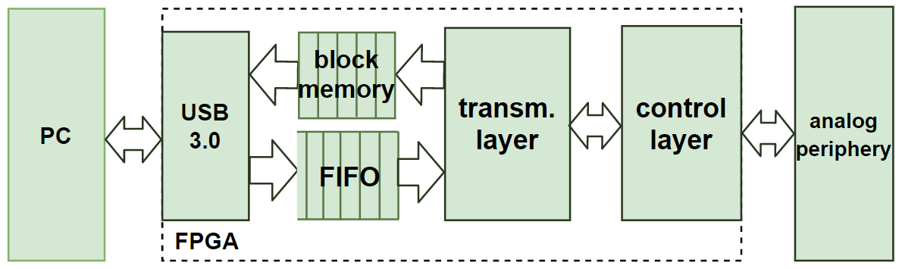
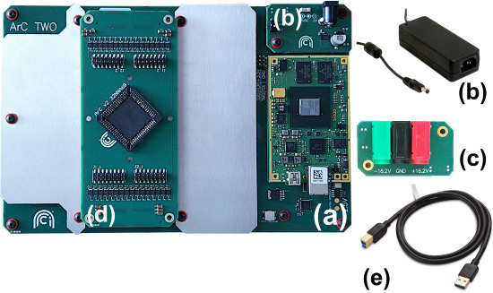
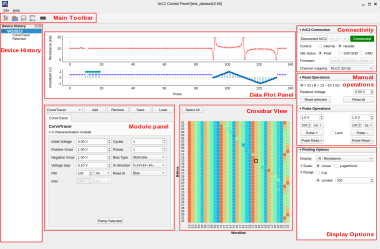
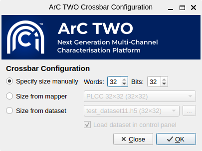
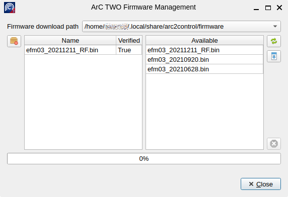
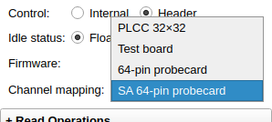
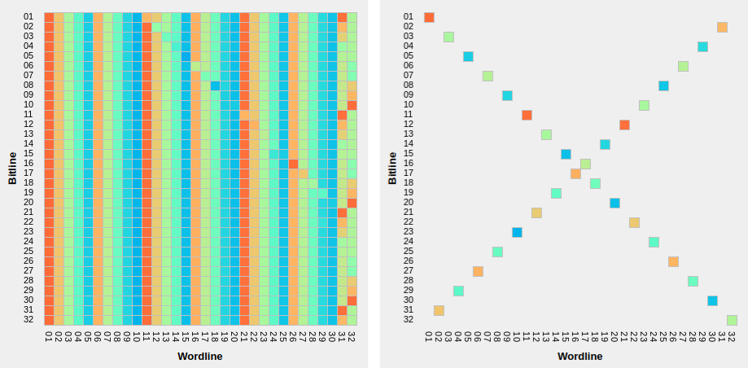

ArC2Control User's Guide
========================

ArC TWO is our next generation electronic characterisation tool which enables
massive parallel testing of devices with arbitrary interconnections. It can
achieve sub-100 ns pulsing across 20 V of voltage.

You are reading this document because you recently acquired an ArC TWO. This
guide will cover installation, firmware management and basic usage. It is
mainly intended for end-users but there's separate :doc:`developer's guide
</api_modules>` if you want to start building upon the ArC TWO platform.

Minimum system requirements
---------------------------

ArC TWO requires a Windows 10/11 or Linux computer with at least 4 GB of RAM
(8 GB or more recommended). A USB-3.0 port is also required to allow ArC TWO to
operate at full speed. Please note that on Linux the minimum glibc supported by
ArC TWO is 2.14. This essentially means every distribution newer than CentOS 7.
Additionally libusb-1.0 is required which should be available on most
distributions released after 2015.  Linux systems based on musl libc (for
instance Alpine Linux) are not supported.

High-level description of ArC TWO
---------------------------------

ArC TWO is essentially a 64-channel, fully parallel SMU array and 2× banks of
32 digital pins. The instrument also features a shared current source.   The
entire system is coordinated by an FPGA EFM-03 development board with Xilinx
XC7A200T-2FBG676I chip. ArC TWO has been engineered to provide high-throughput,
parallel testing at high levels of accuracy.

   (left) Schematic of channel architecture: Significant wires in blue,
   analogue switches in red; (right) Schematic of the structure of the
   channel cluster

The main subsystem of the board is the SMU channel. It consists of: (a) a
*programmable gain trans-impedance amplifier* (TIA); (b) an independent *pulse
generator* used for high-speed pulsing and (c) *a switch* which allows the
channel to access the current source. Data converter terminals are connected as
shown in the figure above to provide biasing with digital to analogue
converters (DACs). This allows the channel to act as a tuneable source, or to
read voltages with differential analogue to digital converters (ADCs) at
selected nodes for measurement. ArC TWO features 8 channel clusters for a
total of 64 independent SMU channels.

The digital interface bridges the gap between the PC and the analogue circuitry
of ArC TWO. The basic structure contains a *USB 3.0 IP core*, a *FIFO buffer*,
*block memory*, a *transmission layer* and a *control layer*. All IPs are
linked through and Advanced eXtensible Interface (AXI) which is a universal
high-performance interface.

   Hierarchy of the digital interface implemented by ArC TWO

The instruction set has been designed for translating a relatively small set of
high-level operations into *board language*. These are: *select channels*,
*emit pulse*, *read from channel(s)* as well as *set current* (for the shared
current source) and a few more specialised commands. In hardware, this
translates to configuring the high-speed pulse drives, DACs, ADCs, switches and
digital pins.  All advanced functions can be performed through a combination of
the basic set of commands. The transmission layer performs the translation from
PC-level instructions to PCB-level and the control layer executes the latter.
A native library, `libarc2`_, has been developed to aid in the assembly of
high level operations (*read*, *pulse*, *ramp*, etc) into board level commands.
Python bindings for libarc2, `pyarc2`_ (`documentation`_), are also available as
an easier-to-use interface to develop user-level applications. ArC TWO Control
is also built on pyarc2.

Getting started
---------------

Installation of the CESYS USB Drivers
^^^^^^^^^^^^^^^^^^^^^^^^^^^^^^^^^^^^^

ArC TWO is an FPGA-based tool and uses a Xilinix FPGA implementation provided
by CESYS GmbH: the EFM-03. In order for ArC TWO to operate you need to install
the CESYS USB Drivers for your operating system. On Windows you need to install
the udk3usb drivers from the `CESYS beastlink distribution`_
(beastlink-1.0-windows-free → driver → udk3usb-drivers-windows-1.3.exe). On Linux
scripts that generate packages for your distribution are available from `our
github <https://github.com/arc-instruments/beastlink-rs/tree/master/contrib>`_.

Out of the box
^^^^^^^^^^^^^^

The standard ArC TWO package comes with the following components: (a) The ArC
TWO board; (b) a 18 V power adaptor with its corresponding power module; (c) a
power module for external power supplies; (d) a PLCC32 daughterboard with
headers for probe-card support and (e) a USB-3.0 cable. Depending on your
configuration some components might be pre-assembled on ArC TWO.

   ArC TWO and standard accessories

To power up the board, plug in the provided AC power adaptor and flick the
power switch. If you intend to use a laboratory power supply instead remove the
retaining screws of the standard power module and replace it with the external
power supply module. Then tighten the retaining screws again and plug in an
external supply to the corresponding banana sockets. Please note that you need
**both 16.2 V and -16.2 V sources** and a minimum of 1 A on both to properly
power the board.

ArC TWO supports many different *daughterboards* for maximum connection
flexibility.  By default the 32NNA68 daughterboard is installed which exposes
all 64 channels of ArC TWO as header pins and also features a PLCC socket for
packaged samples.  Typical cavity sizes for these packages are (in inches)
0.265×0.265, 0.3×0.3, 0.4×0.4 and 0.46×0.46. Additional daughterboards are
available with SMA (32 channels) or BNC connectors (12 channels).

Installing the ArC TWO Control Panel
^^^^^^^^^^^^^^^^^^^^^^^^^^^^^^^^^^^^

ArC TWO Control Panel (ArC2Control) is a handy application that is oriented
towards crosspoint operations. That means that the ArC TWO channels are
organised in a 32 by 32 fashion essentially creating 32 different crosspoints.
In a crossbar configuration this allows for up to 1024 interconnection points.
This is by no means indicative of the full capabilities of ArC TWO but it's
a common enough scenario to have its own standalone application.

Since ArC2Control is still in active development the installation requires the
presence of a 64-bit Python interpreter. Please note that **32-bit interpreters
will not work**. Python versions > 3.8 are routinely tested and they should be
expected to work. On Windows we strongly recommend you install the `official
Python distribution <https://python.org>`_ instead of alternative distributions
such as Anaconda. On Linux you can use the Python interpreter that comes with
your distribution. Once Python is installed and available you can install
ArC2Control with the following command in a command line interpreter (any Linux
shell or Windows CMD or Powershell).

.. code-block:: console

   python -m pip install arc2control

Or, alternatively, for the latest development snapshot (requires `git
<https://git-scm.org>`_ to be available)

.. code-block:: console

   python -m pip install git+https://github.com/arc-instruments/arc2control

Please note that on Linux it is strongly recommended that you install
ArC2Control as a regular user, **not root**. Regardless of your installation
method you can launch ArC2Control with the following command

.. code-block:: console

   python -m arc2control

On stable releases Windows installers and Linux AppImages will be made
available from the `release page`_.

The ArC2Control Interface
-------------------------------

Overview
^^^^^^^^

ArC2Control is our recommended way to familiarise yourself with the ArC TWO
platform. It is divided into different functional panels.

   The different functional areas of ArC2Control

These are the following functional areas of ArC2Control:

* **Main Toolbar**: contains buttons that deal with dataset handling as well as
  firmware management.
* **Device History**: lists all experiments performed on devices defined by
  crosspoints, oldest first. Depending on the experiment you can double click
  on any experimental entry to bring up the collected data and experimental
  attributes.
* **Data Plot Panel**: displays all biasing history for the selected crosspoint
* **Connectivity Panel**: controls connection to ArC TWO, firmware selection and
  channel mapping management.
* **Manual operations**: handles manual biasing or reading actions performed to
  selected crosspoints.
* **Crossbar view**: Current resistance values of all devices in the crossbar.
* **Module panel**: Experiment panel management. Both built-in and external modules
  are available here.
* **Display and plotting options**: manages type of value to display (resistance,
  conductance, current), y-axis scale and number of historic data points to
  display.

Starting a new session
^^^^^^^^^^^^^^^^^^^^^^

When you first start ArC2Control you will be greeted with crossbar
configuration dialog which allows you to configure the size of the crossbar
that will be managed by ArC TWO.

   The crossbar configuration dialog

You can specify the size of the crossbar either manually, through a mapping
scheme or by loading an already existing dataset. In the latter case you can
additionally load the dataset in ArC2Control so that you can continue working
on it.

Connecting to ArC TWO and firmware management
^^^^^^^^^^^^^^^^^^^^^^^^^^^^^^^^^^^^^^^^^^^^^

Before connecting to ArC TWO you will need to install the firmware required by
the on-board FPGA. If no firmware is found, ArC2Control will prompt you to open
the firmware manager. You can also bring up the firmware manager by clicking
the corresponding button on the main toolbar.

   The firmware management dialog - Firmware file **efm03_20211211_RF.bin** is
   already downloaded.

Clicking the *Refresh available firmwares* button (top right) will query the
ArC Instruments Server for available firmwares. It will then list all available
firmwares (newest first) on the right-hand panel. You can download the firmware
by clicking the *Download selected firmware* button which should then appear on
the locally installed firmwares on the left-hand panel. New firmwares will be
posted occasionally so check the firmware manager for updates. There are
several locations that ArC2Control can store firmware (see *Firmware download
path*). It is recommended that you use the user-local directory which is
``%APPDATA%/arc2control/firmwares`` on Windows or
``~/.local/share/arc2control/firmwares`` on Linux. Using a global directory
would allow you to share the firmware files among multiple users of the same
computer but in that case you need to start ArC2Control with elevated
permissions which is generally not recommended.

Closing the firmware manager will update the available firmwares available in
the *Connectivity Panel* on the main ArC2Control UI. If you have already
plugged in and powered-on an ArC TWO board the board ID will be available next
to *Connect/Disconnect ArC2* button. If not, connect and power-on an ArC TWO
board and press the *Refresh* button which should be populated with all
discovered device IDs. Make sure you select the firmware you downloaded (or any
other) so that it can be loaded on the instrument. Newest firmwares are listed
higher on the list. Upon successful connection the green *Connected* indicator
will lit up and you are now ready to use ArC TWO. Clicking the
*Connect/Disconnect ArC2* button will disconnect the tool and the red
*Disconnected* indicator will now appear.

Control modes and idle status
^^^^^^^^^^^^^^^^^^^^^^^^^^^^^

ArC TWO provides two control modes of operation, found under the *ArC2
Connection* panel. In *Internal* mode ArC TWO biasing will be diverted to the
internal switching matrix. In *Header* mode it will use the external control
scheme. In the context of the 32NNA68 daughterboard, for example, that means
either the PLCC68 socket (internal) or the header bank (header). Different
daughterboard utilise the control modes differently so follow the documentation
provided with the daughterboard.

The *Idle Status* control determines how ArC TWO will manage the channels once
an operation has been completed. In all cases voltage will be set to 0.0 V but
channel connections will differ depending on the selected option. There are
three different possibilities: (a) *Float* to completely disconnect the
channels from biasing; (b) *Soft GND* will set all channels to 0.0 V but still
connect them to output source and (c) *GND* will switch the channels to the
physical ground.

The channel mapper
^^^^^^^^^^^^^^^^^^

ArC TWO presents 64 arbitrarily interconnected channels. In order to effectively
utilise them for a specific experimental scenario a *channel mapper* is required.
The channel mapping mechanism provides a way to map the internal ArC TWO channels
to useful word- and bitlines in a crossbar configuration. ArC2Control comes with
a set of default mappers, namely *PLCC 32×32* that can be used for packaged devices;
*Test board* for debugging purposes; *64-pin probecard* for our standard 1R
probecards; *SA 64-pin probecard* for our standard 1R probecards in stand-alone
configuration (1 device per wordline) and *BNC breakout* for the 6×6 BNC board.
Channel mappers can be selected on the fly from the *Channel mapping* dropbown
located under the *ArC2 Connection* panel.

   The channel mapper dropdown listing mappings suitable for a 32×32 crossbar
   array.

.. note::
   The mappers available on the *Channel mapping* dropdown are only the ones
   suitable for the currently configured crossbar size. For instance if you
   setup a 32×32 crossbar the *BNC breakout* channel mapping will not be
   available as it is only applicable 6×6 crossbar configuration. You can
   configure the crossbar dimensions during ArC2Control startup.

You can create additional mappings depending on your experimental setup.
Further documentation on how to do so can be found in our :doc:`developer
documentation </api_mapper>`.

The crossbar view
^^^^^^^^^^^^^^^^^

   A fully populated 1 kb 32×32 crossbar (left) and a crossbar with one
   crosspoint per wordline ("standalone array")

The crossbar panel shows an overview of the current status of all configured
crosspoints. Depending on the active mapper and crossbar configuration during
ArC2Control startup the number of crosspoints as well as the geometry of the
array itself can vary. On the image above the crossbar on the left depicts a
full 32×32 array whereas the one on the right a "standalone array" ie. an
array with only one crosspoint per word-/bitline. Hovering over a crosspoint
will display the coordinates and value of the crosspoint under the cursor.
*Double-clicking* on the crossbar view will select the crosspoint under the
cursor. You can hold down the *Ctrl* key and double-click on additional
crosspoints to expand the selection. Alternatively you can click and drag
on the crossbar view to select more than one crosspoints. The current
selection can be cleared by *right-clicking*.

Device history
^^^^^^^^^^^^^^

The *Device History* panel lists all experiments performed to individual
crosspoints in chronological order (oldest first). Depending on the
experiment, double-clicking on an experiment will bring up the collected
data and the experiment attributes, if any.

Additionally, right clicking on a crosspoint ID will allow you to export
the biasing history of that crosspoint which includes manual operations
as well as experiments performed. You can export the full history or a
specific range in a ``csv`` file.

Manual operations
^^^^^^^^^^^^^^^^^

ArC2Control offers a series of manual operations that can be applied to one or
more crosspoints. You can select the read-out voltage used throughout the
software and you can read one or more selected crosspoints.  ArC2Control will
optimise the biasing scheme depending on the number of selected channels. If
channels are located along the same bitline one parallel read instruction will
be issued with current sinked on the bitline. If channels are located in more
than one bitlines parallel reads will be done for each one of the selected
bitlines. When reading the whole array with *Read All* a series of parallel
reads will be done for each of the bitlines in the current configuration.

.. note::
   Although read-out voltage is configured globally modules can still use a
   different read-out voltage depending on their functionality. Most of the
   built-in modules will offer you an option to configure read voltage without
   affecting the global read-out voltage.

The same philosophy applies to manual pulse and pulseread operations. The
positive and negative polarities can be configured independently or the two can
be locked to the same amplitude and pulse width by toggling the *Lock*
checkbox. When pulsing you have the option of applying a singular pulse or
pulsing and then immediately reading the selected crosspoints.

Pulse and reads are denoted with separate symbols on the data plot panel. For
operations that do not return a value (pulse only) no value is plotted on the
top half of the data plot but the pulse properties are still recorded.

Display options
^^^^^^^^^^^^^^^

The final panel of the main ArC2Control UI is the *Display Options* panel which
controls the value displayed on the main data plot as well as the scaling of
the X and Y axes. You can select between *resistance*, *conductance*, *current*
or *absolute current*. You can also control the number of displayed points,
although it is recommended that you keep the value relatively low for data
intensive operations.

.. _`CESYS beastlink distribution`: https://www.cesys.com/fileadmin/user_upload/service/FPGA/fpga%20boards%20%26%20modules/BeastLink/beastlink-1.0-windows-free.zip
.. _`release page`: https://github.com/arc-instruments/arc2control/releases
.. _`libarc2`: https://github.com/arc-instruments/libarc2
.. _`pyarc2`: https://github.com/arc-instruments/pyarc2
.. _`documentation`: http://files.arc-instruments.co.uk/documents/pyarc2/latest/index.html
